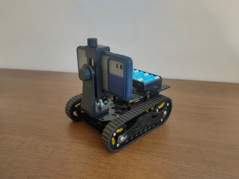
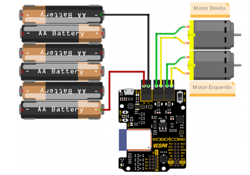

# OwlVision_VehicleController

## 1. Introdução
O OwlVision é o projeto de conclusão de curso que foi divido em três repositorios: 

    * OwlVision_AppAndroid : Aplicativo android com função de captura de imagens, interpretação das imagens e geração de trajetórias, desenvolvido majoritariamente em Java.
    * OwlVision_MLVisions: Conjunto de pipelines de processamento de imagens, como por exemplo, pipeline de geração dos modelos de estimação de profundidade e segmentação semantica, também a geração dos parametros intrinsecos da camera e outras pipelines auxiliares.
    * OwlVision_VehicleController: Serviço que recebe os dados de trajetória e faz o controle do veiculo, atráves dos atuardores (motores).

## 2. Estrutura Mecânica

## 3. Estrutura Eletrônica

## 4. Referências de Projeto
https://www.robocore.net/tutoriais/controle-web-robo-com-vespa